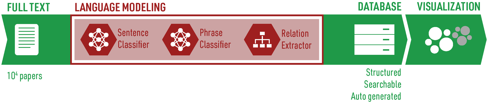

---

### 🔋🔍 **NLP4SIB**: Extracting a Database of Challenges and Mitigation Strategies for Sodium-ion Battery Development 


### 🌟 Key Highlights
- **Database of Challenges**: A detailed compilation of the challenges faced in the performance and synthesis of SIB CAMs: `database/challenge_database.xlsx`
- **Mitigation Strategies**: Identification and pairing of challenges with potential mitigation strategies: `database/mitigation_database.xlsx`

### 🖥️ NLP Pipeline

*The sequential filtering and visualization pipeline utilizing sentence classification, phrase-level classification, and relationship extraction.*

### 📩 Contact
For inquiries or further information, please contact: *mrigi@mit.edu*

### 🙌 Acknowledgements
Special thanks to Vineeth Venugopal, Elsa Olivetti, Kevin J. Huang, Ryan Stephens, and MIT for their support.

---

#### Start DYGGIE++

```bash
allennlp train "phrase_classifier/best_parameter_study_improvement.json" \
    --serialization-dir "phrase_classifier/dygiepp/models/improvement" \
    --include-package dygie

allennlp train "phrase_classifier/best_parameter_study_challenge.json" \
    --serialization-dir "phrase_classifier/dygiepp/models/challenge" \
    --include-package dygie 
